# Endless Run


## ゲーム概要
**プレイヤーが制限なく走り続けることができるエンドレスランニングゲーム**  

- プレイヤーはステージ上に配置されたコインを集めながら、できる限り長い距離を走ることを目指します 
- コインを集めた数に応じてランクが上がり、同数のコインを集めた場合は、より遠くまで走ったプレイヤーが上位にランクインします 
- プレイヤーの反射神経と集中力が試されるゲームであり、**電気を帯びた球体**や**壁**といった障害物を避けることがゲーム攻略の鍵となります

## 制作環境
```
UnrealEngine version: 5.3.2
Platform: Windows
```

## 環境構築

### UnrealEngine のセットアップ
**EpicGamesLauncher** をインストール
- [公式ページ](https://www.unrealengine.com/ja/download)

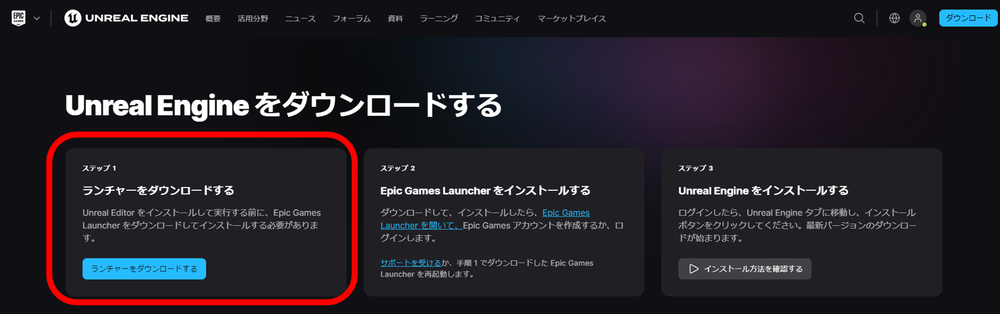

**EpicGamesLauncher** の **UnrealEngine** → **ライブラリ** に移動  
**Engineバージョン** の「+」ボタンをクリック  
バージョンが書かれている所の▼をクリックし、**5.3.2** を選択

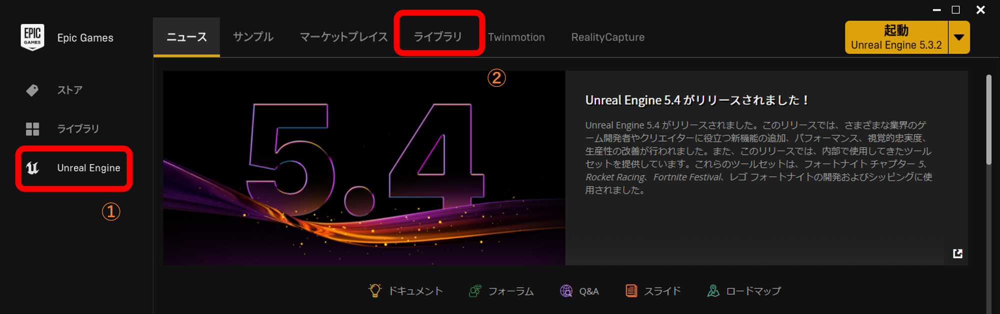
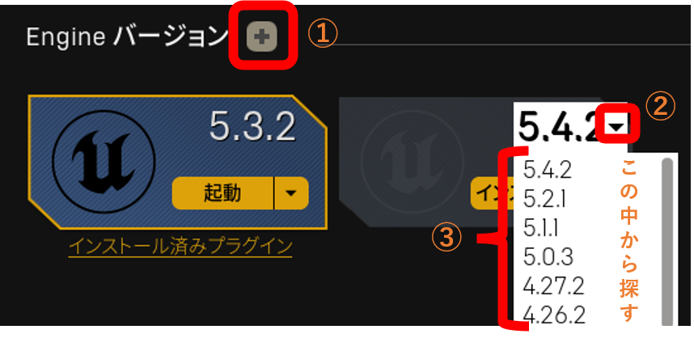

**インストール** → **オプション** → **デバッグに必要なエディタシンボル** を有効にする  
インストールする場所を決めて、**インストール** をクリック  
※ 私の環境では、すでに **5.3.2** はインストールしてあるので、例として **5.4.2** にしている
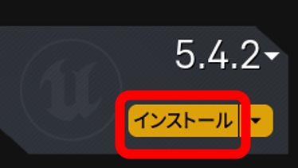
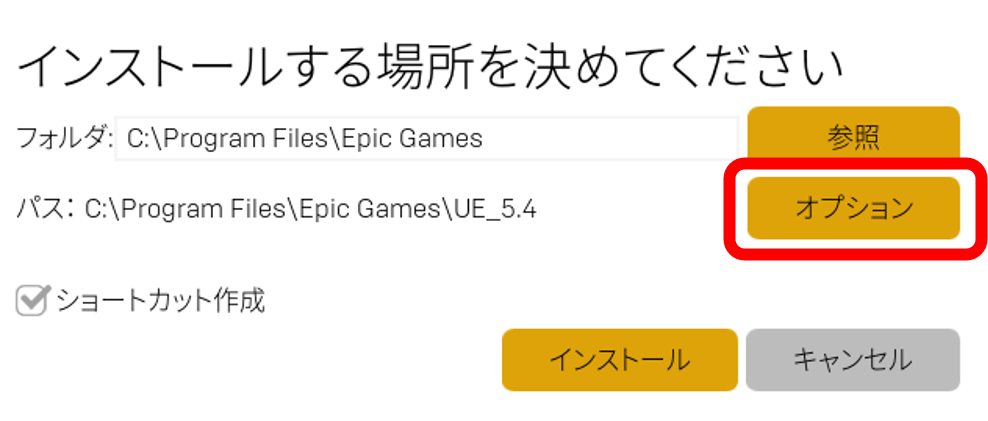
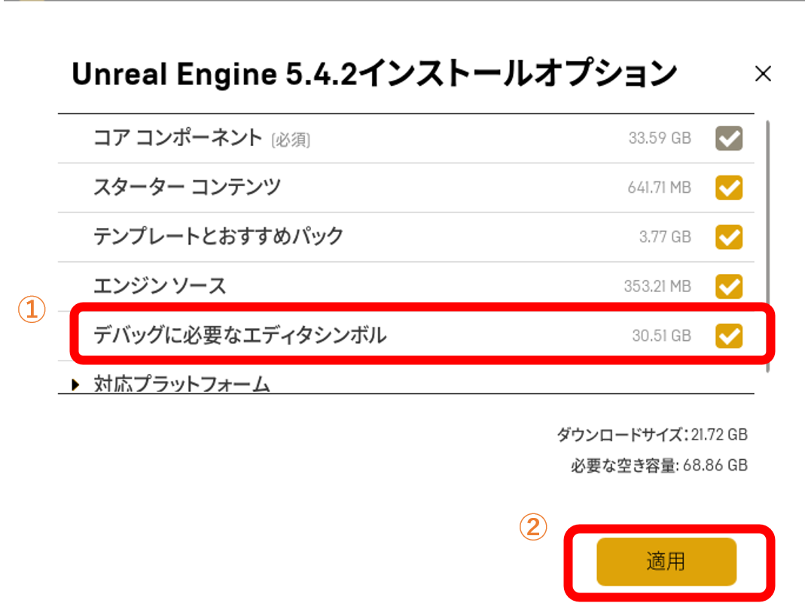
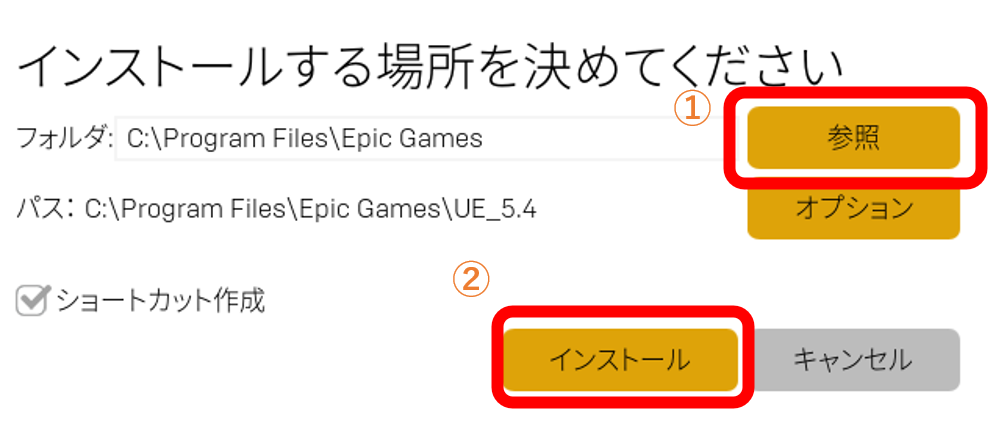

### Visual Studio 2022 のセットアップ
**Visual Studio 2022** を公式ページからダウンロードする
- [公式ページ](https://visualstudio.microsoft.com/ja/)  

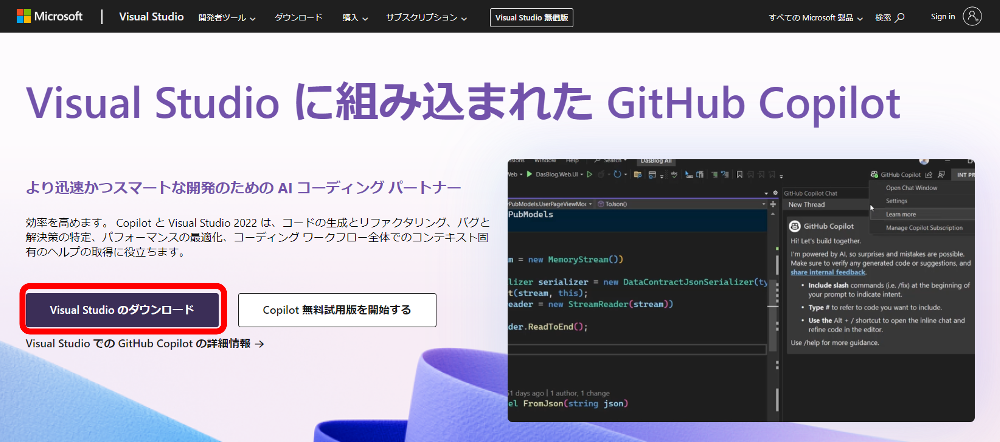

ダウンロードしたインストーラー(**VisualStudioSetup.exe**)を実行する  
**Visual Studio Installer** が開くので

- **C++によるゲーム開発**
- **Windows11SDK**
- **Windows10SDK**
- **UnrealEngine のインストーラー**
- **CUnrealEngine 用の Android IDE サポート**

を有効にして、インストールする  
インストールが終わったら、PC を再起動

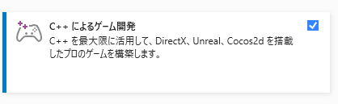
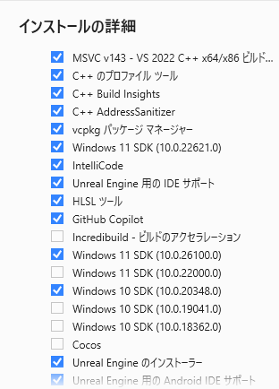

### ソースコードの確認・編集のやり方
共有した **EndlessRun.zip** には最初ソリューションファイルがない

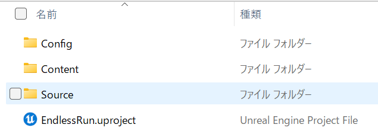

**GUNMAN.uproject** を右クリック  
**その他のオプションを確認** → **Generate Visual Studio project files** をクリック  
これでソリューションファイルが生成される 

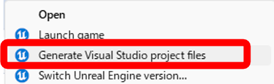

次に使用するエディターを **Visual Studio 2022** にする
**GUNMAN.uproject** から **UnrealEngine** のエディターを開く

メニューバーの **編集** → **エディターの環境設定…** をクリック  
**一般** → **ソースコード** → **Accessor** → **ソースコードエディタ** で  
**Visual Studio 2022** をクリックして、再起動する

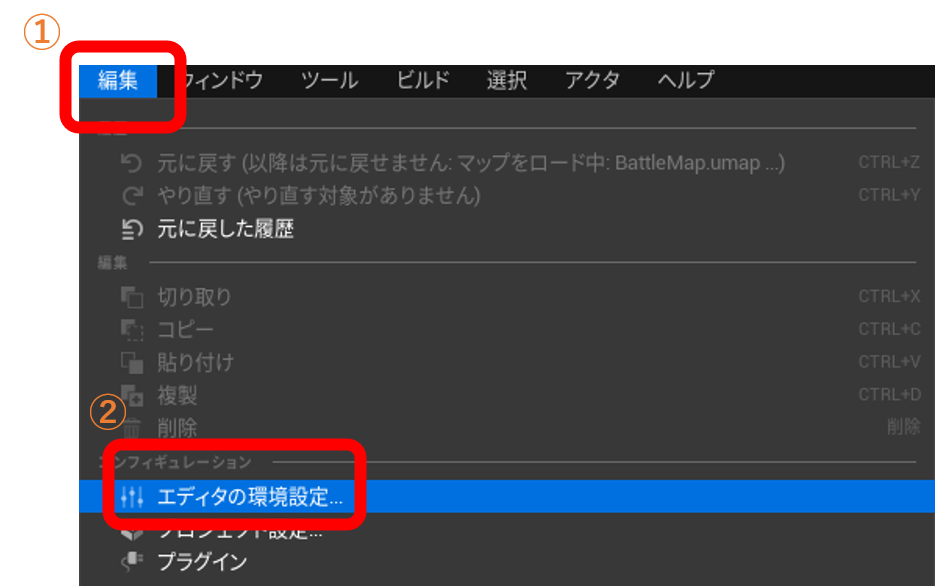
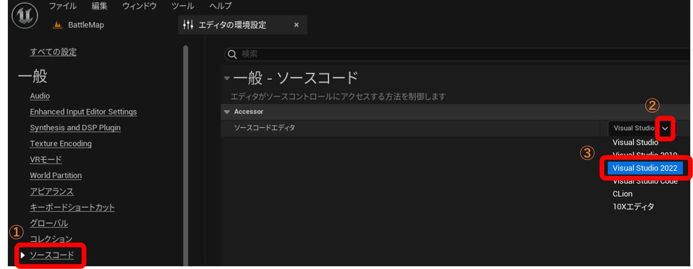

再起動できたら、**EndlessRun.sln** を開いて編集できる

## 操作説明

|      操作      |  キーボード・マウス  |
| :------------: | :------------------: |
|    ジャンプ    |     スペースバー     |
|     右移動     |        D, 右        |
|     左移動     |        A, 左        |
| ポーズメニュー |          Q          |
|  角で左に回る  |        D, 右        |
|  角で右に回る  |        A, 左        |
|    決定操作    |  マウス左クリック  |

## 詳細情報
[Documentation](Documentation/) をチェックしてください。