# ブラッシュアップした箇所

GUNMMAN のブラッシュアップした箇所について一つずつまとめていく。  
1 ～ 9 までは 4 月あたりの変更点で、それ以降の番号は 5, 6 月に変更した。

## 1.プレイヤ―の各武器の攻撃力を変更

今まではプレイヤーの攻撃力は 10 で一定  
それだと連射性能が一番高いライフルしか実用性がない。

面白くないので、 武器の攻撃力(WeaponATK)の変数を作り、連射性能が低いピストルやショットガンは攻撃力を高くし、連射性能が高い TPS と FPS のライフルは攻撃力を低くした。

これで、ゲームに戦略性を持たせることができた。

|               ライフル(TPS)               |           ショットガン(TPS)           |            ピストル(TPS)            |               ライフル(FPS)               |
| :---------------------------------------: | :-----------------------------------: | :---------------------------------: | :---------------------------------------: |
| 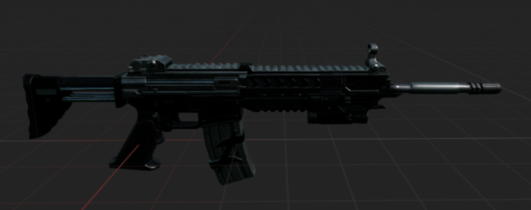 | 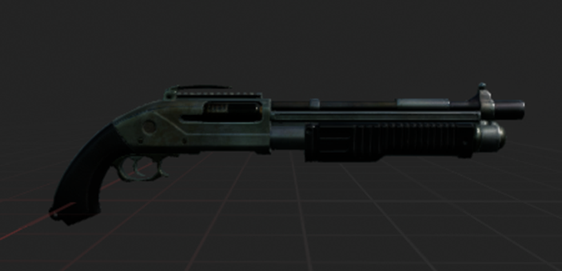 | 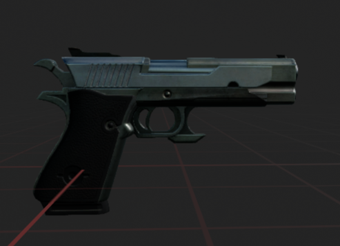 | 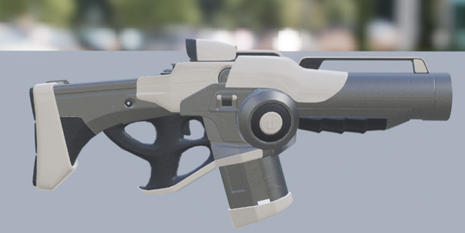 |
|                5 ダメージ                 |              15 ダメージ              |             10 ダメージ             |                5 ダメージ                 |

[1.ソースコード](https://github.com/yu03040/EngineerPortfolio/commit/a25ed5cfa9cf09bd746817306600bd37743bae54)  
[2.ソースコード](https://github.com/yu03040/EngineerPortfolio/commit/cc9d280066de0b78531eb7b6b40315164a2811d6)

## 2.敵の攻撃力を変更

プレイヤーと同様に敵も攻撃力が 10 で一定  
それだと自分の体力が 1000 もあるため、ダメージが低く面白くない。  
そこで、各敵の攻撃力を上げてゲームに緊張感を持たせました。

| BP_EnemyAI_Random | BP_EnemyAI_Path_A | BP_EnemyAI_Path_B |
| :---------------: | :---------------: | :---------------: |
| ランダムに動く敵  | 巡回路 A を動く敵 | 巡回路 B を動く敵 |
|   100 ダメージ    |    60 ダメージ    |    50 ダメージ    |

※ これらのブループリントは基底クラスとして [AIEnemy](../Source/GUNMAN/Enemy/AIEnemy.cpp) クラスをもつ。

## 3.敵の射程距離を変更

今までは敵がプレイヤーに近い位置(1 メートル)にならないと攻撃してこなかった。  
逃げながら戦えばプレイヤーの体力が減ることはほとんどない。

そこで、ゲームの難易度をあげるために 10 メートル離れた位置から攻撃してくるように変更した。

## 4.敵の色を変更

敵の色を黒色で統一していた。  
すべての敵が同じルートを巡回するわけではなく、攻撃力も違うので変更することにした。  
これで、攻撃力が大きい敵を識別できるので戦略が立てられるようになった。

|          BP_EnemyAI_Random           |          BP_EnemyAI_Path_A          |          BP_EnemyAI_Path_B          |
| :----------------------------------: | :---------------------------------: | :---------------------------------: |
|           ランダムに動く敵           |          巡回路 A を動く敵          |          巡回路 B を動く敵          |
| 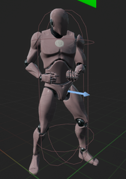 | 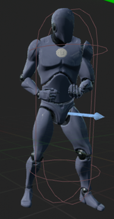 | 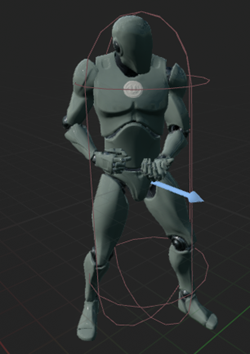 |

## 5.敵が建物に隠れていてもシルエットが見えるようにを変更

敵に変更を加えてきたことでゲームの難易度が上がり、  
クリアしづらいので、敵の位置をどこからでもわかるようにシルエットが見えるよう変更した。

これで、敵の位置が把握しやすくなったのでちょうどいい難易度のゲームにできた。

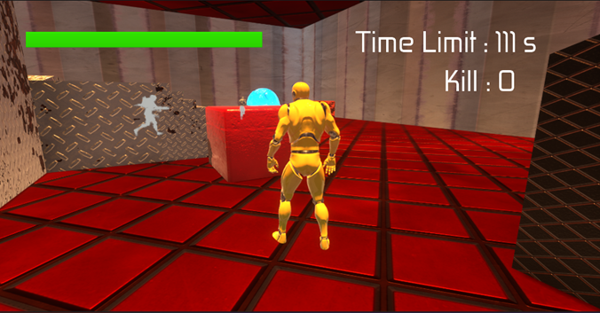

この画像のように敵が灰色のシルエットとして表示される。  
ゲームを開始して描画が終わった後に、テクスチャに対して後処理(ポストプロセス)をして追加効果(シルエット表示)をつけた。

## 6.敵の体力バー(UI)が 100 分率にならない不具合を修正

敵の体力は 30 だったのにもかかわらず、  
Health を 100 で割っていたので UI 表示がおかしくなっていた。

修正したことで、敵の体力を把握しやすくなり、戦いやすい。

[ソースコード](https://github.com/yu03040/EngineerPortfolio/commit/589b573e639fc8c31585a766fea0eb374b2ffade)

## 7.敵の出現位置が巡回ルート上にない不具合の修正

今までは、ゲームが始まって敵が生成される位置と巡回ルートの開始位置は離れていた。  
そのため、敵が巡回ルートの開始位置まで移動し、そこから巡回ルート上を移動していた。

しかし、これだと巡回ルートの開始位置に行く途中でプレイヤーを見つけることがあり、巡回ルートが意味がない。

そこで、巡回ルートの開始位置のそばから敵が生成されるようにレベル上のアクターの配置を変更した。

## 9.フィールドの色味を変更

フィールドの明るさがバラバラなところが多く不自然に感じたので、ライトの調整をした。  
原因はポイントライト(球体状の光)やスポットライト(コーン状の光)を多用していたからだった。

|                      修正前                      |                     修正後                     |
| :----------------------------------------------: | :--------------------------------------------: |
| 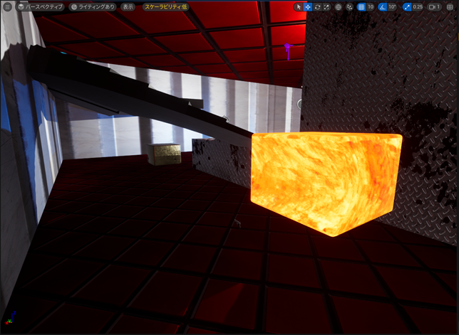 | 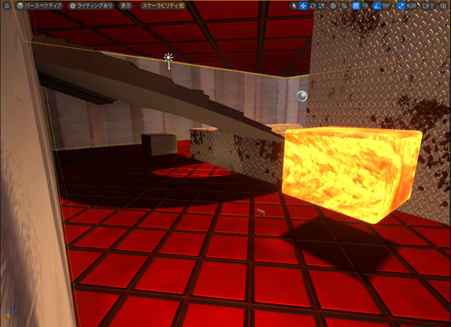 |

修正前の画像を見てもらえばわかるように天井は照らされているが、他の場所は暗くなっている。  
そのため、ディレクショナルライト(太陽光)とスカイライト(環境光)のふたつで全体を明るくし、他のライトは削除した。

また、天井があり空間がひとかたまりのメッシュになっているので、光が透過されない。  
そこで、天井のライティングの「cast shadow」をオフにして光を透過させるようにした。

## 10.チュートリアル画面の操作方法説明を変更

操作方法の説明が文字だけとなっており、ぱっと見て分かりにくい。  
そこで、ゲームコントローラーの画像を基に説明するように変更した。

|                         修正前                          |                        修正後                         |
| :-----------------------------------------------------: | :---------------------------------------------------: |
| 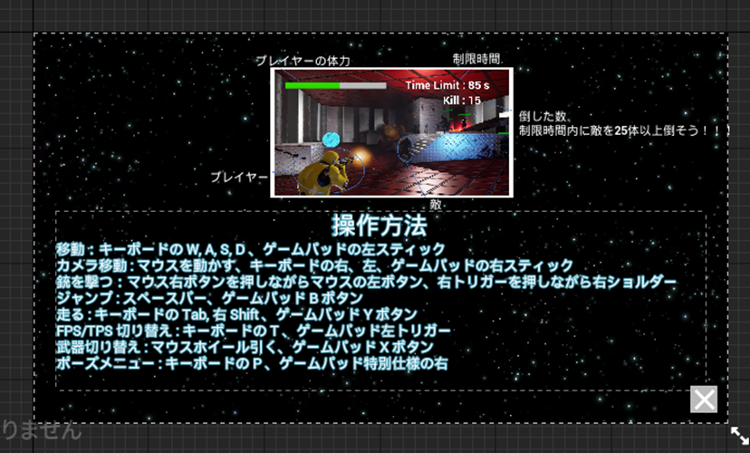 | 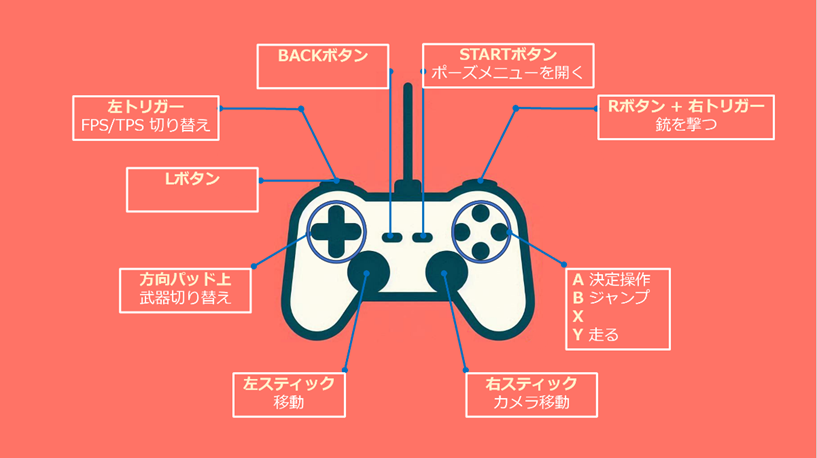 |

このようにすることで、操作方法がイメージしやすい。

## 11.プレイヤーの UI と制限時間の UI を分けて管理するように変更

制限時間はゲームのルールに関係するため、ゲームモードで管理する方が正しいと考えた。

|               GANMANCharacter の UI               |            GUNMANGameMode の UI            |
| :-----------------------------------------------: | :----------------------------------------: |
| 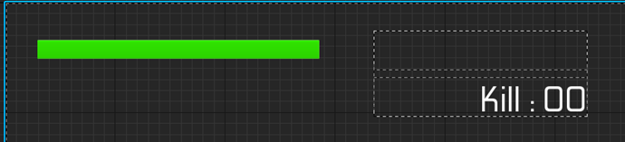 | 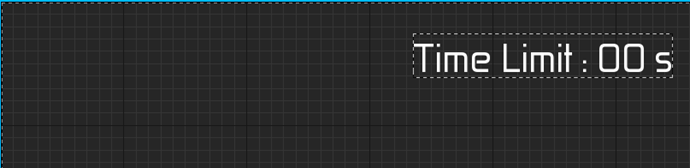 |

プレイヤーの UI は体力と倒した数にし、ゲームモードの UI は制限時間にした。
