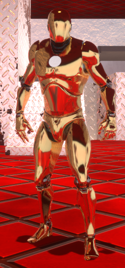
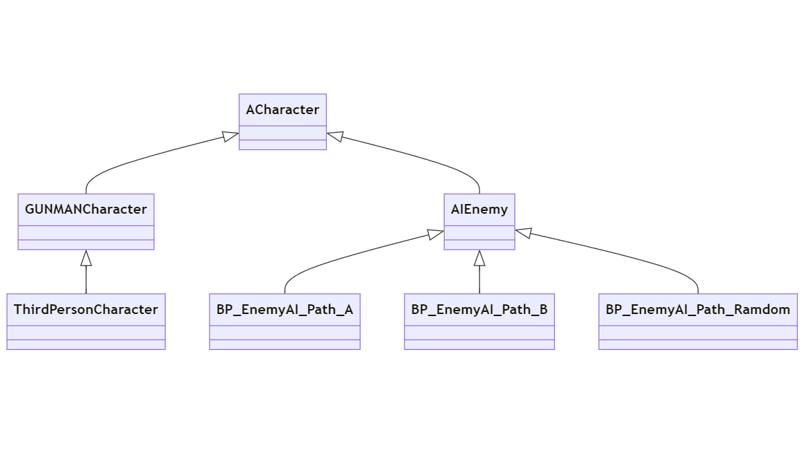

# GUNMANCharacter クラスの説明

## GUNMANCharacter クラスの概要

`GUNMANCharacter` クラスは、プレイヤーキャラクターとして動作する `ACharacter` クラスを継承したクラスです。  
このキャラクターは、ゲーム内での移動やアクション、カメラの操作、銃を使用する機能を持っています。  
`ThirdPersonCharacter`	クラスは `GUNMANCharacter` クラスを継承した Blueprint クラスです。

主な機能は以下の通りです。

- **コンストラクターでの設定**: Tick の設定、カプセルコンポーネントの初期化、カメラの設定、銃メッシュやマズルの設定、AI 感知コンポーネントの設定、Enhanced Input のロードとバインド、タイムラインの設定。
- **入力処理**: Enhanced Input を使用して、さまざまなアクション（ジャンプ、射撃、カメラ切り替え、武器の装備/脱装備）に対して入力をバインドしています。
- **OnConstruction**: 一人称視点の銃をアタッチし、キャラクターが使用できるように設定します。
- **UIの表示**: 銃を構えた時に照準のウィジェットやキャラクターの UI を表示します。
- **その他の機能**: 銃の発射、発射アニメーション、武器のアタッチ/リムーブ、ダメージ処理、移動、視点の操作など。

## このクラスのソースコードの説明

### コンストラクター（`AGUNMANCharacter::AGUNMANCharacter`）
`AGUNMANCharacter` クラスのコンストラクターは、キャラクターの初期設定を行います。カメラ、キャラクターのカプセルコンポーネント、武器、AI 感知コンポーネント、Enhanced Input の設定が含まれています。

1. **カプセルコンポーネントの設定**:
   - キャラクターのコリジョン範囲を設定します。デフォルトでは半径 42.0f、カプセルの高さ 96.0f に設定されています。これにより、キャラクターの衝突判定を行う領域が決まります。

2. **カメラの設定**:
   - 一人称視点 (FPS) と三人称視点 (TPS) 用のカメラをそれぞれ設定します。FPS 用のカメラはキャラクターの目の位置に近く、TPS 用のカメラはキャラクターの背後に配置されます。また、カメラの回転やズームの設定も行います。

3. **AI 感知コンポーネント**:
   - キャラクターが周囲の音や視覚的な情報を感知するための `UAIPerceptionStimuliSourceComponent` を設定します。AI キャラクターがプレイヤーを検知できるようになります。

4. **武器とマズルの設定**:
   - 武器メッシュと発射点 (マズル) の設定を行います。一人称視点用の銃の位置、三人称視点用の銃の位置がそれぞれ設定され、マズルフラッシュを表示するための座標も決定されます。

5. **タイムラインの設定**:
   - 移動速度を補間するためのタイムラインを初期化します。これにより、キャラクターの速度変更やその他のアニメーションがスムーズに行われます。

### `BeginPlay` 関数
ゲーム開始時にプレイヤーコントローラーを取得し、Enhanced Input の設定を行います。さらに、三人称視点アニメーションの設定や UI の表示もここで行います。

1. **プレイヤーコントローラーの取得**:
   - キャラクターがプレイヤーによって操作されている場合、そのコントローラーを取得します。これにより、入力や HUD の設定が正しく行われます。

2. **Enhanced Input の設定**:
   - Enhanced Input によって管理される各アクションをゲーム内で利用可能にするための初期化が行われます。射撃、移動、カメラ切り替えなどのアクションがここで設定されます。

3. **UI の表示**:
   - キャラクターが武器を構えた時に表示される照準や、その他のゲーム内 UI（例えば HP バーや弾薬カウントなど）が初期化されます。

### コンストラクションスクリプト（`OnConstruction`）
コンストラクションスクリプトとは ゲームプレイ中ではなく編集時やコンパイル時に実行できる Blueprint です。
Blueprint でのコンストラクションスクリプトの処理を C++ で実装する際にこの関数を使います。  
- ゲーム内でのキャラクターの構築時に、一人称視点用の銃を腕にアタッチします。

### `Tick` 関数
毎フレーム呼び出され、リアルタイムでの処理を行う関数です。ここでは、タイムラインの更新が管理されます。

- **タイムラインの状態管理**:
   - タイムラインが再生中かどうかを確認し、再生中であれば、キャラクターの移動速度などのパラメータを補間して更新します。これにより、滑らかなアニメーションや動作が実現されます。

### `LoadEnhancedInput` 関数
プレイヤーの入力処理を行うために、Enhanced Input アクションやコンテキストをロードする関数です。
- **アクションのロード**:
   - ジャンプ、射撃、移動、カメラの切り替えなどのプレイヤーアクションがここで定義され、プレイヤーが行う操作に応じて処理が実行されます。

### `SetupPlayerInputComponent` 関数
プレイヤー入力コンポーネントの設定を行います。Enhanced Input に基づいてアクションをバインドし、プレイヤーの入力を正しく処理します。

### `StartFire, FiringEvent, StopFire, OnFire` 関数
キャラクターが銃を発射する際の処理を行う関数群です。

#### `StartFire`:
   - プレイヤーが発射ボタンを押した時に呼び出され、射撃アニメーションやサウンドを再生します。また、弾薬が発射されます。

#### `FiringEvent`:
   - フルオート射撃のような連続射撃が可能な場合、弾が発射され続けるイベントを管理します。

#### `StopFire`:
   - 射撃ボタンが離された際に射撃を停止し、発射アニメーションを終了させます。

#### `OnFire`:
   - 銃が発射された時にアニメーション、サウンド、弾の発射を処理し、敵にダメージを与えるなどのロジックを実行します。

### `FireState_Implementation` 関数
- 射撃可能な状態を管理する実装です。

### `AttachWeapon_Implementation` 関数
- 銃をキャラクターにアタッチするためのメソッドです。

### `AnimationAtFiring` 関数
射撃時に再生されるアニメーションを管理します。

- 射撃が行われた際に再生されるアニメーションを切り替え、リロードやその他の動作に対応します。

### `ToggleBetweenTPSAndFPS` 関数
キャラクターの視点をTPS（サードパーソン）とFPS（ファーストパーソン）の間で切り替えます。

- `bIsFlipped` というフラグを使って、現在の視点を確認
- `ToggleFlipflop` 関数を呼び出してカメラのアクティブ状態やキャラクターのメッシュ表示を変更します。
- 最終的に `bIsFlipped` を反転させて、次回呼び出されたときに正しく視点を切り替えられるようにします。

### `ToggleFlipflop` 関数
この関数は、TPSとFPSの視点切り替えに関する処理を実行します。特に、次の要素を切り替えます：
- カメラのアクティブ状態 (`ThirdPersonCamera` と `FirstPersonCamera`)
- キャラクターのメッシュ表示 (`GetMesh()` と `Mesh1P`)
- 武器の表示や非表示
- キャラクターの向き (`bUseControllerRotationYaw`)
- FPSモードの場合の武器の状態

### `StartReadyGun` 関数
キャラクターが武器を準備するためのプロセスを開始します。

- `GunPreparationProcess` 関数を呼び出し、キャラクターのエイム状態を設定
- 照準 (`UIGunSightRef`) を画面に表示します。

### `GunPreparationProcess` 関数
キャラクターのエイム状態やカメラの設定を変更します。具体的には：
- `bIsAiming` フラグに基づき、エイム状態を更新
- カメラアームの長さや位置、キャラクターの向きなどを変更
- アニメーションインターフェースを通じて、アニメーションにエイム状態を反映させます

### `StopReadyGun` 関数
武器の準備を終了し、エイム状態を解除します。また、照準を画面から取り除きます。

### `AttachingAndRemovingGun` 関数
キャラクターが武器を装備または取り外す際に使用されます。
- 武器のインデックスに基づいて、武器をセットし、表示または非表示にします。
- データテーブルから武器の情報を取得し、発砲時のアクションを設定します。

### `PressedActionPoseMenu` 関数
ポーズメニューに関連するアクションを実行します。特定のバトルマップにアクセスし、ポーズメニューのボタン配置を初期化し、プレイヤーコントローラーの入力マッピングコンテキストを切り替えます。

### `StartJump` 関数
キャラクターがジャンプを開始する際に呼び出される関数です。

- `Jump()` 関数を呼び出し、ジャンプが可能かをチェックします。また、キャラクターの移動速度に応じてジャンプ力 (`JumpZVelocity`) を設定します。

### `StopJump` 関数
ジャンプを終了するための関数です。

- `StopJumping()` を呼び出し、ジャンプの状態をリセットします。

### `HandleAnyDamage` 関数
ダメージを受けた際に呼び出され、キャラクターの体力を減少させます。体力が一定値以下になった場合にはゲームオーバーマップをロードします。

### `CreateTimeline` 関数
タイムラインを作成し、キャラクターのスピードを線形補間で制御します。`RunTimeline` を作成し、タイムラインの更新時に `Timeline_LinearInterpCharacterSpeed()` を呼び出します。

### `Timeline_LinearInterpCharacterSpeed` 関数
タイムラインの進行に応じて、キャラクターの歩行速度を更新します。

### `StartTimeline` 関数
タイムラインを開始する関数です。

### `ReverseTimeline` 関数
タイムラインを逆再生するための関数です。

### `RemoveWeapon` 関数
キャラクターが所持している武器のインデックスに基づき、特定の武器を取り外す関数です。

### `CountWeapon` 関数
キャラクターが持っている武器の数をカウントし、次の武器を選択するためのインデックスを管理します。

### `EquipWeapon` 関数
武器をキャラクターに装備または取り外す処理を行います。アニメーションインターフェースを使って、装備状態をアニメーションにも反映します。

### `DisplayGunSight` 関数
銃の照準を画面に表示するための関数です。WidgetBlueprint からクラスを取得し、照準用のウィジェットを作成します。

### `DisplayCharacterUI` 関数
キャラクターのUIを画面に表示します。`UUICharacter` のインスタンスを作成し、画面に追加します。

### `MoveForward` 関数
キャラクターを前方に移動させるための関数です。プレイヤーの入力に基づいて、移動方向を決定し、その方向に移動します。

### `MoveRight` 関数
キャラクターを右方向に移動させるための関数です。`MoveForward()` 同様に、入力に基づいて右方向に移動します。

### `Look` 関数
プレイヤーがマウスやコントローラーで視点を操作する際に呼び出される関数です。横方向（ヨー）と縦方向（ピッチ）の入力に基づいて視点を変更します。