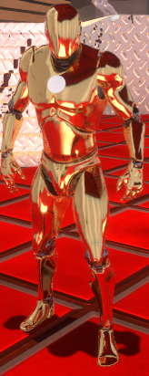

# GUNMAN Source Code

このドキュメントでは、GUNMAN のソースコードの主な部分を簡単に説明します。

## GUNMAN GameMode Class

[GUNMAN GameMode](/GUNMAN/Source/GUNMAN/GUNMANGameMode.cpp) はゲーム全体のルールを定義している。  
ここでは、プレイヤーの管理やゲームの状態管理を設定するために使用。

制限時間の UI を表示している。

勝利条件と敗北条件を定義している。  
勝利条件は前は 25 体以上倒さなければならなかったが、敵を強くしたので条件を軽くした。

- 勝利条件：敵を 10 体以上倒す
- 敗北条件：制限時間を過ぎてしまう  
  ※ プレイヤーキャラクターが死んだときは [GUNMAN Character](/GUNMAN/Source/GUNMAN/GUNMANCharacter.cpp) からの処理

## GUNMAN Character Class

[GUNMAN Character](/GUNMAN/Source/GUNMAN/GUNMANCharacter.cpp) はプレイヤーキャラクターの動作を定義している。

### GUNMAN Character Constructor

- プレイヤーキャラクターの初期化

### ゲーム開始処理（BeginPlay）

- アニメーション、メッシュ、カメラの設定
- マウスの非表示
- UI の操作をオフ
- FPS やエイムのとき以外はプレイヤーキャラクターが回転しない
- 敵からダメージを受けたときダメージ処理

### ゲーム中常に実行される処理（Tick）

走る処理のタイムライン実行

### 入力処理

- 移動
- ジャンプ
- 走る
  - 走るスピードは一定ではなく、走り始めてから段々と速くなる
  - timeline で実装
- 攻撃
  - ボタンが押されている間は攻撃し、離すと攻撃をやめる
- FPS/TPS 切り替え
  - フリップフロップで実装
  - ボタンが押されたとき、カメラを変え、一方のメッシュを非表示
- 武器切り替え
- 視点変更
- ポーズメニューを開く

### その他

このクラスを基底クラスとして、ブループリントの派生クラスを作成している。

そのブループリントでキャラクターのマテリアルを変更した。

- 元々,金色のマテリアルに変えたいと思っていたが、やり方が分からず黄色のような色だったのを金色に修正

|                            修正前                            |                          修正後                          |
| :----------------------------------------------------------: | :------------------------------------------------------: |
|  |  |
