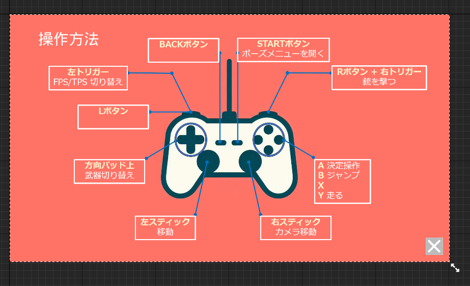

# UMG Source Code

このドキュメントでは、UMG のソースコードの主な部分を簡単に説明します。  
※ UMG = Unreal Motion Graphics  
ゲーム中の UI(User Interface)のこと

## UI Character Class

[UI Character](/GUNMAN/Source/GUNMAN/UMG/UICharacter.cpp) はプレイヤーキャラクターの UI を定義している。
  

### 画像の説明

- HP Bar は**緑色**の横棒
- Time Limit は制限時間
- Kill はキルスコア

### Native Constructor

ユーザーの初期化処理（制限時間の UI, プレイヤーキャラクターの参照）を行う。

### UI Binding

- HP Bar をプレイヤーキャラクターの体力にバインドする
- Kill をプレイヤーキャラクターの倒した数にバインドする  
  ※ バインド...変数の値をリアルタイムで変更する

## UI Enemy Class

[UI Enemy](/GUNMAN/Source/GUNMAN/UMG/UIEnemy.cpp) は敵キャラクターの UI を定義している。  
  

### 画像の説明

- HP Bar は**緑色**の横棒

### Native Constructor

ユーザーの初期化処理（敵キャラクターの参照）

### UI Binding

- HP Bar を敵キャラクターの体力にバインドする

## UI Title Class

[UI Title](/GUNMAN/Source/GUNMAN/UMG/UITitle.cpp) はタイトル画面の UI を定義している。  

  

### 画像の説明

- 上の画像はタイトル画面で、下の画像は「**?**」を押したときに表示される操作説明画面
- Game Start はゲーム開始ボタン
- Game End はゲーム終了ボタン
- ? は操作説明ボタン
- × はタイトル画面に戻るボタン

### UI Binding

- ボタンが押されるとそれぞれの処理が走るようにバインドする

## UI GameClear Class

[UI GameClear](/GUNMAN/Source/GUNMAN/UMG/UIGameClear.cpp) はゲームクリア画面の UI を定義している。
  

### 画像の説明

- Continue はコンティニューボタン
- Game End はゲーム終了ボタン

### UI Binding

- ボタンが押されるとそれぞれの処理が走るようにバインドする

## UI GameOver Class

[UI GameOver](/GUNMAN/Source/GUNMAN/UMG/UIGameOver.cpp) はタイトル画面の UI を定義している。
  

### 画像の説明

- Continue はコンティニューボタン
- Game End はゲーム終了ボタン

### UI Binding

- ボタンが押されるとそれぞれの処理が走るようにバインドする

## UI PaseMenu Class

[UI PaseMenu](/GUNMAN/Source/GUNMAN/UMG/UI_PaseMenu.cpp) はポーズメニューの UI を定義している。
  

### 画像の説明

- Back to Title はタイトル画面に戻るボタン
- Cancel はゲームに戻るボタン
- Game End はゲーム終了ボタン

### UI Binding

- ボタンが押されるとそれぞれの処理が走るようにバインドする

## UI Gun Sight Class

[UI Gun Sight](/GUNMAN/Source/GUNMAN/UMG/UIGunSight.cpp) は銃の照準の UI を定義している。  
  
この UI はエイムしているときのみ表示している。