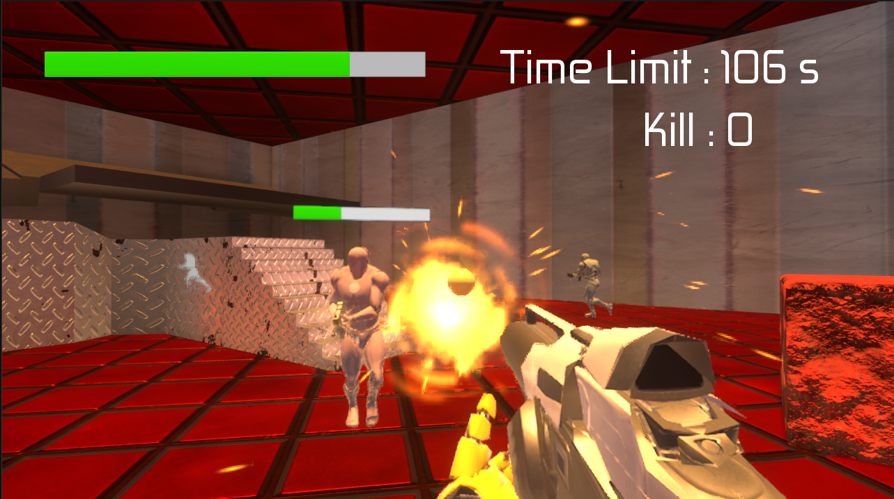

# GUNMAN



## ゲーム概要
**自主制作したゲーム**  
自動生成される敵を銃で倒すFPS/TPS対応ゲームです。  
当然、敵も攻撃してくるので、 HP が 0 にならないように立ち回ります。  
時間制限も設けているので、その間に倒さないとゲームオーバーになります。  

## 制作環境
```
UnrealEngine version: 5.3.2
Platform: Windows
```

## 操作説明

| 操作 | コントローラー | キーボード・マウス |
| :--- | :------------: | -----------------: |
| ジャンプ |  B ボタン  |    スペースバー    |
|   移動   | 左スティック | W, A, S, D |
| カメラ移動 | 右スティック | 右、左、マウスを動かす |
| 銃を撃つ | 右トリガー + 右ショルダー | マウス右ボタン + マウス左ボタン |
| 走る | Y ボタン | Tab, 右 Shift |
| FPS/TPS 切り替え | 左トリガー | T |
| 武器切り替え | 十字キーの上ボタン | マウスホイールを引く |
| ポーズメニュー | スタートボタン | P |
| ポーズメニューの項目を決定 | A ボタン | Enter | 

## 詳細情報
[Documentation](Documentation/) をチェックしてください。