# GUNMAN


## ゲーム概要
**自主制作したゲーム**  
自動生成される敵を銃で倒すFPS/TPS対応ゲームです。  
当然、敵も攻撃してくるので、 HP が 0 にならないように立ち回ります。  
時間制限も設けているので、その間に倒さないとゲームオーバーになります。  

## 制作環境
```
UnrealEngine version: 5.3.2
Platform: Windows
```

## 環境構築

### UnrealEngine のセットアップ
**EpicGamesLauncher** をインストール
- [公式ページ](https://www.unrealengine.com/ja/download)

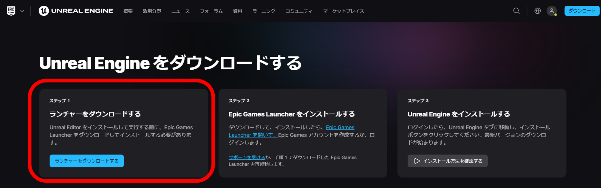

**EpicGamesLauncher** の **UnrealEngine** → **ライブラリ** に移動  
**Engineバージョン** の「+」ボタンをクリック  
バージョンが書かれている所の▼をクリックし、**5.3.2** を選択

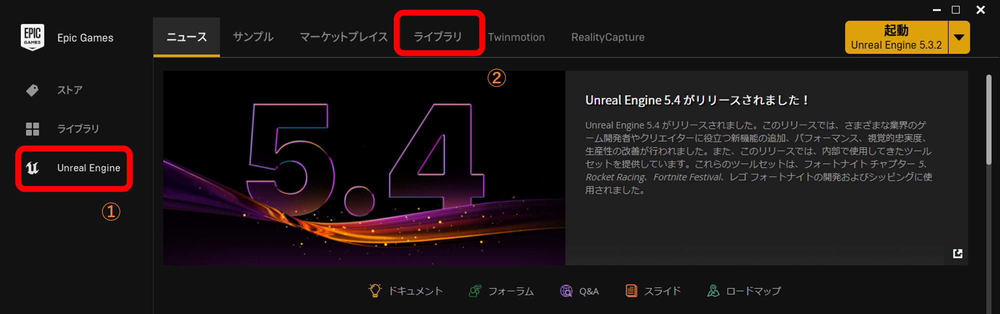
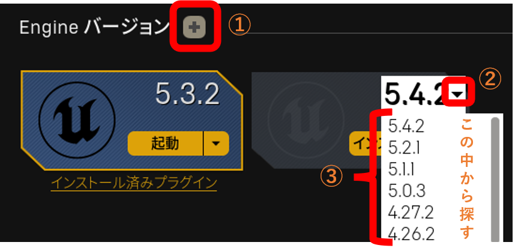

**インストール** → **オプション** → **デバッグに必要なエディタシンボル** を有効にする  
インストールする場所を決めて、**インストール** をクリック  
※ 私の環境では、すでに **5.3.2** はインストールしてあるので、例として **5.4.2** にしている
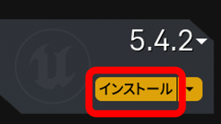
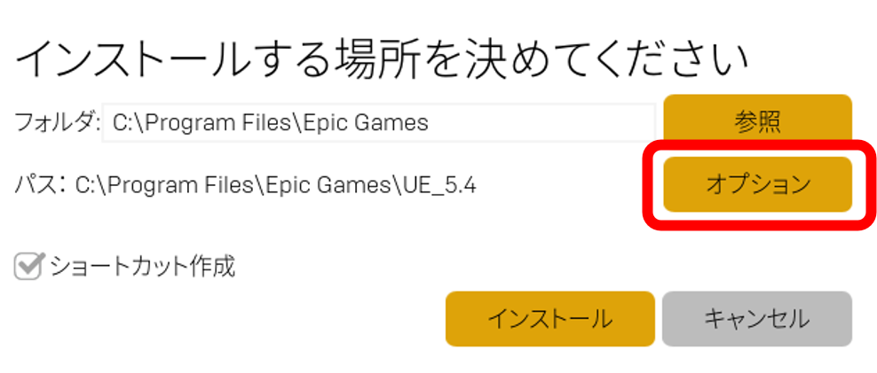
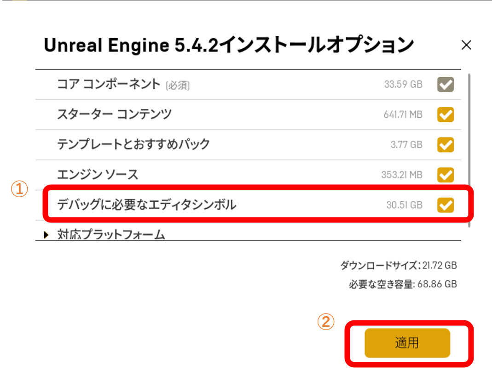
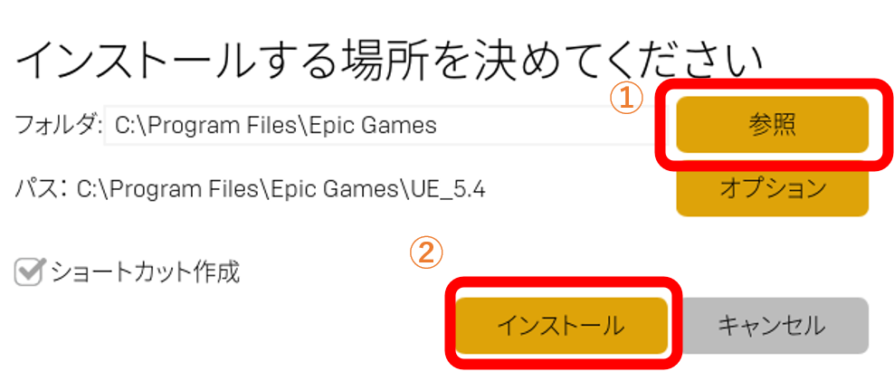

### Visual Studio 2022 のセットアップ
**Visual Studio 2022** を公式ページからダウンロードする
- [公式ページ](https://visualstudio.microsoft.com/ja/)  

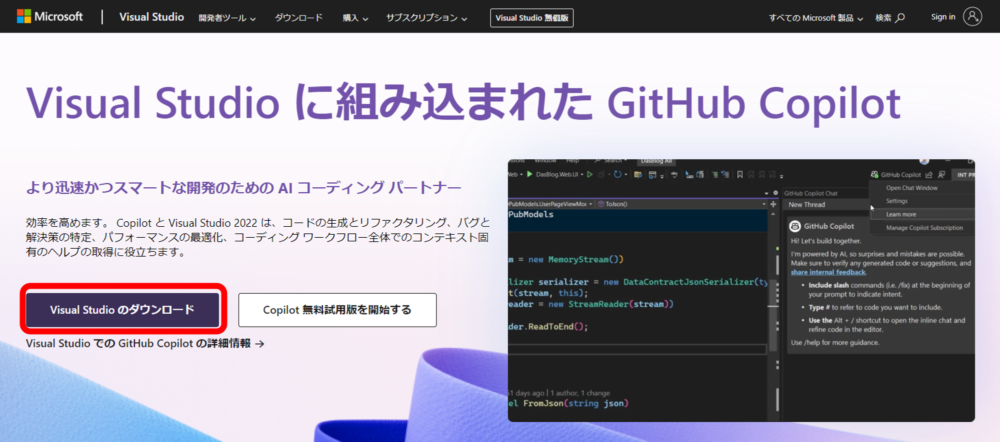

ダウンロードしたインストーラー(**VisualStudioSetup.exe**)を実行する  
**Visual Studio Installer** が開くので

- **C++によるゲーム開発**
- **Windows11SDK**
- **Windows10SDK**
- **UnrealEngine のインストーラー**
- **CUnrealEngine 用の Android IDE サポート**

を有効にして、インストールする  
インストールが終わったら、PC を再起動

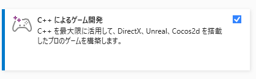
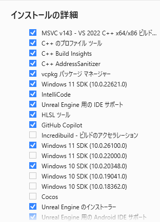

### ソースコードの確認・編集のやり方
共有した **GUNMAN.zip** には最初ソリューションファイルがない

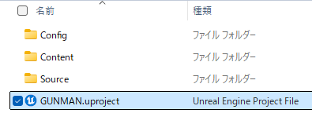

**GUNMAN.uproject** を右クリック  
**その他のオプションを確認** → **Generate Visual Studio project files** をクリック  
これでソリューションファイルが生成される 

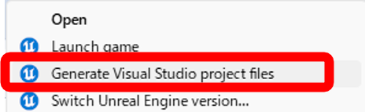

次に使用するエディターを **Visual Studio 2022** にする
**GUNMAN.uproject** から **UnrealEngine** のエディターを開く

メニューバーの **編集** → **エディターの環境設定…** をクリック  
**一般** → **ソースコード** → **Accessor** → **ソースコードエディタ** で  
**Visual Studio 2022** をクリックして、再起動する

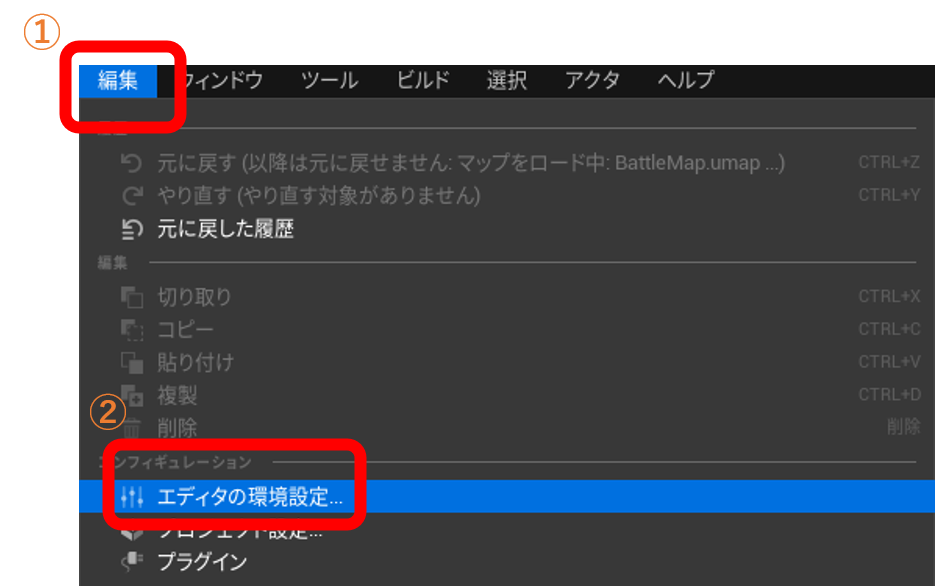
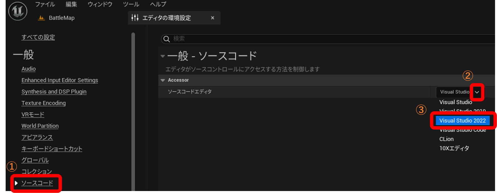

再起動できたら、**GUNMAN.sln** を開いて編集できる

## 操作説明

| 操作 | コントローラー | キーボード・マウス |
| :--- | :------------: | -----------------: |
| ジャンプ |  B ボタン  |    スペースバー    |
|   移動   | 左スティック | W, A, S, D |
| カメラ移動 | 右スティック | 右、左、マウスを動かす |
| 銃を撃つ | 右トリガー + Rボタン | マウス右ボタン + マウス左ボタン |
| 走る | Y ボタン | Tab, 右 Shift |
| FPS/TPS 切り替え | 左トリガー | T |
| 武器切り替え | 方向パッドの上 | マウスホイールを引く |
| ポーズメニュー | STARTボタン | P |
| 決定操作 | A ボタン | Enter | 

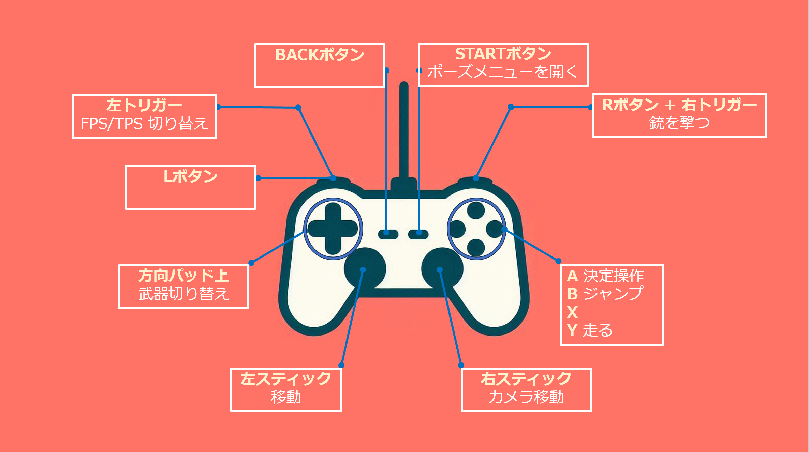

## 詳細情報
[Documentation](Documentation/) をチェックしてください。